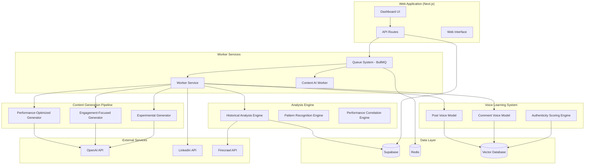

# Technical Architecture - LinkedIn Content Generation Enhancement

## Architecture Overview

The enhanced LinkedIn content generation system transforms from a basic voice mimicking tool into an intelligent, performance-driven content generation platform through four core subsystems:

### System Components



## Current Architecture Analysis

### Existing Infrastructure
Based on audit of current system:

**Web Application**: Next.js 14 with App Router
- Location: `/src/app/`
- UI Components: shadcn/ui (Radix UI + Tailwind)
- State Management: React state + Server actions
- Database: Supabase integration

**Worker Services**: Multi-service architecture
- `worker-service/`: Main background processing service
- `linkedin-ai-content-worker/`: Specialized queue worker
- Queue System: BullMQ with Redis
- Background Processing: Content generation, research, analysis

**Current Database Schema**: 
- Supabase PostgreSQL
- Existing tables for connections, posts, profiles
- Current schema documented in `supabase tables.md`

## Enhancement Architecture

### 1. Historical Analysis Engine

**Purpose**: Analyze historical posts to identify performance patterns

**Components**:
- **Data Ingestion Service**: Extracts historical posts from LinkedIn/Supabase
- **Content Analysis Pipeline**: Processes text, structure, timing patterns  
- **Performance Correlation Engine**: Maps content elements to engagement metrics
- **Pattern Storage**: Optimized storage for quick pattern retrieval

**Technical Stack**:
```typescript
// Core interfaces
interface HistoricalPost {
  id: string
  content: string
  engagement_metrics: EngagementMetrics
  content_features: ContentFeatures
  temporal_data: TemporalData
}

interface PerformancePattern {
  pattern_id: string
  success_indicators: string[]
  engagement_correlation: number
  confidence_score: number
}
```

**Database Tables**:
- `historical_analysis_results`
- `performance_patterns` 
- `content_features_cache`

### 2. Enhanced Voice Learning System

**Purpose**: Separate voice models for posts vs comments with authenticity scoring

**Components**:
- **Dual Model Training**: Separate processing for posts and comments
- **Linguistic Analysis Engine**: Extracts tone, vocabulary, structure patterns
- **Authenticity Scoring**: Real-time voice matching validation
- **Model Update Pipeline**: Continuous learning from new content

**Technical Implementation**:
```typescript
interface VoiceModel {
  model_id: string
  content_type: 'post' | 'comment'
  linguistic_patterns: LinguisticPattern[]
  authenticity_thresholds: AuthenticityThresholds
  last_trained: timestamp
}

interface AuthenticityScore {
  voice_match_score: number // 0-100
  confidence_level: number
  deviation_factors: string[]
}
```

**Database Tables**:
- `voice_models`
- `authenticity_scores`
- `linguistic_patterns`

### 3. Three-Variant Content Generation Engine

**Purpose**: Generate three strategically different content approaches per topic

**Variant Strategies**:

1. **Performance-Optimized**: Based on top 10% historical performers
2. **Engagement-Focused**: Maximizes comment-driving elements  
3. **Experimental**: Tests new approaches while maintaining authenticity

**Technical Architecture**:
```typescript
interface GenerationRequest {
  topic: string
  target_voice: 'post' | 'comment'
  context_data?: ContextData
  performance_constraints?: PerformanceConstraints
}

interface GenerationResult {
  variants: [
    ContentVariant, // Performance-Optimized
    ContentVariant, // Engagement-Focused  
    ContentVariant  // Experimental
  ]
  generation_metadata: GenerationMetadata
}

interface ContentVariant {
  content: string
  strategy: 'performance' | 'engagement' | 'experimental'
  predicted_metrics: PredictedMetrics
  authenticity_score: number
  optimization_notes: string[]
}
```

### 4. Performance Feedback Loop

**Purpose**: Learn from actual published content performance to improve future generation

**Components**:
- **Performance Tracking Service**: Monitors published content metrics
- **Learning Pipeline**: Updates models based on real-world results
- **Pattern Correlation**: Maps predictions to actual outcomes
- **Model Improvement Engine**: Refines generation algorithms

## Data Flow Architecture

### Content Generation Flow
1. **Input Processing**: Topic + strategy selection
2. **Context Retrieval**: Historical patterns + voice model
3. **Multi-Variant Generation**: Three parallel generation processes
4. **Quality Validation**: Authenticity scoring + content validation
5. **Response Formatting**: Structured response with metadata

### Learning Flow
1. **Performance Monitoring**: Track published content engagement
2. **Pattern Analysis**: Identify successful/unsuccessful elements  
3. **Model Updates**: Refine patterns and generation rules
4. **Validation**: Test improved models against historical data

## Database Schema Changes

### New Tables Required

```sql
-- Historical Analysis
CREATE TABLE historical_analysis_results (
    id UUID PRIMARY KEY DEFAULT gen_random_uuid(),
    post_id TEXT NOT NULL,
    content_features JSONB NOT NULL,
    performance_metrics JSONB NOT NULL,
    success_patterns TEXT[] NOT NULL,
    created_at TIMESTAMP WITH TIME ZONE DEFAULT NOW()
);

-- Performance Patterns
CREATE TABLE performance_patterns (
    id UUID PRIMARY KEY DEFAULT gen_random_uuid(),
    pattern_name TEXT NOT NULL,
    pattern_elements JSONB NOT NULL,
    success_correlation DECIMAL(5,4) NOT NULL,
    confidence_score DECIMAL(5,4) NOT NULL,
    usage_count INTEGER DEFAULT 0,
    last_validated TIMESTAMP WITH TIME ZONE DEFAULT NOW()
);

-- Voice Models
CREATE TABLE voice_models (
    id UUID PRIMARY KEY DEFAULT gen_random_uuid(),
    content_type voice_content_type NOT NULL,
    linguistic_patterns JSONB NOT NULL,
    authenticity_thresholds JSONB NOT NULL,
    model_version INTEGER DEFAULT 1,
    training_data_count INTEGER NOT NULL,
    last_trained TIMESTAMP WITH TIME ZONE DEFAULT NOW()
);

-- Content Generation Jobs
CREATE TABLE content_generation_jobs (
    id UUID PRIMARY KEY DEFAULT gen_random_uuid(),
    topic TEXT NOT NULL,
    generation_request JSONB NOT NULL,
    generated_variants JSONB,
    performance_predictions JSONB,
    status generation_status DEFAULT 'pending',
    created_at TIMESTAMP WITH TIME ZONE DEFAULT NOW(),
    completed_at TIMESTAMP WITH TIME ZONE
);

-- Performance Feedback
CREATE TABLE performance_feedback (
    id UUID PRIMARY KEY DEFAULT gen_random_uuid(),
    generation_job_id UUID REFERENCES content_generation_jobs(id),
    published_content TEXT,
    actual_metrics JSONB,
    predicted_vs_actual JSONB,
    learning_insights JSONB,
    feedback_date TIMESTAMP WITH TIME ZONE DEFAULT NOW()
);
```

### Indexes for Performance
```sql
-- Performance pattern lookups
CREATE INDEX idx_patterns_correlation ON performance_patterns(success_correlation DESC);
CREATE INDEX idx_patterns_confidence ON performance_patterns(confidence_score DESC);

-- Historical analysis queries
CREATE INDEX idx_historical_features ON historical_analysis_results USING GIN(content_features);
CREATE INDEX idx_historical_performance ON historical_analysis_results USING GIN(performance_metrics);

-- Voice model lookups
CREATE INDEX idx_voice_models_type ON voice_models(content_type);
CREATE INDEX idx_voice_models_version ON voice_models(content_type, model_version DESC);

-- Generation job tracking
CREATE INDEX idx_generation_status ON content_generation_jobs(status, created_at);
```

## API Architecture

### New API Endpoints

```typescript
// Historical Analysis
POST /api/content/historical-analysis
GET  /api/content/performance-insights
GET  /api/content/performance-patterns

// Voice Learning
POST /api/content/voice-analysis
GET  /api/content/voice-models/{type}
POST /api/content/authenticity-check

// Content Generation
POST /api/content/generate-variants
GET  /api/content/job/{id}
POST /api/content/optimize-content

// Performance Feedback
POST /api/content/performance-feedback
GET  /api/content/learning-insights
```

### Queue Architecture

**Enhanced BullMQ Jobs**:
```typescript
// Historical analysis jobs
'historical-analysis': {
  data: { userId: string, startDate: Date, endDate: Date },
  priority: 1
}

// Voice learning jobs  
'voice-learning': {
  data: { userId: string, contentType: 'post' | 'comment' },
  priority: 2
}

// Content generation jobs
'generate-content': {
  data: GenerationRequest,
  priority: 3
}

// Performance tracking jobs
'performance-tracking': {
  data: { contentId: string, trackingDuration: number },
  priority: 4
}
```

## Scalability Considerations

### Performance Targets
- **Content Generation**: < 30 seconds for 3 variants
- **Historical Analysis**: < 2 minutes for 100 posts  
- **Voice Model Training**: < 5 minutes for 1000 content pieces
- **Concurrent Users**: 10 simultaneous requests

### Caching Strategy
- **Redis Caching**: Performance patterns, voice models
- **Database Caching**: Frequently accessed historical data
- **CDN Caching**: Static UI components and assets

### Horizontal Scaling
- **Worker Scaling**: Multiple worker instances for different job types
- **Database Scaling**: Read replicas for analysis queries
- **Queue Scaling**: Separate queues for different priority levels

## Security & Privacy

### Data Protection
- **Content Encryption**: All generated content encrypted at rest
- **API Security**: Rate limiting, authentication, input validation
- **Privacy Controls**: User data isolation, retention policies

### API Security
```typescript
// Authentication middleware
const authenticateRequest = async (req: NextRequest) => {
  // Verify JWT token
  // Check user permissions  
  // Rate limiting
}

// Input validation
const validateGenerationRequest = (data: unknown): GenerationRequest => {
  // Zod schema validation
  // Sanitize input content
  // Check content length limits
}
```

## Monitoring & Analytics

### Performance Monitoring
- **Application Metrics**: Response times, error rates, throughput
- **Business Metrics**: Generation success rates, authenticity scores  
- **Infrastructure Metrics**: Database performance, queue health

### Error Handling & Logging
```typescript
// Structured logging for all components
const logger = {
  info: (message: string, metadata?: object) => {},
  error: (error: Error, context: string, metadata?: object) => {},
  performance: (operation: string, duration: number, metadata?: object) => {}
}
```

## Development Environment Setup

### Required Environment Variables
```bash
# Enhanced system variables
OPENAI_MODEL=gpt-4
OPENAI_API_KEY=your_openai_key

# Database
SUPABASE_URL=your_supabase_url
SUPABASE_SERVICE_ROLE_KEY=your_service_key

# Queue System  
REDIS_URL=your_redis_url

# Performance Analysis
HISTORICAL_ANALYSIS_BATCH_SIZE=50
VOICE_LEARNING_MIN_SAMPLES=25
```

### Local Development Stack
```bash
# Start all services
docker-compose up -d postgres redis

# Start Next.js app
npm run dev

# Start worker services
npm run worker:dev
npm run content-worker:dev
```

This technical architecture provides the foundation for implementing the performance-driven content generation enhancement while maintaining the existing system's reliability and extending its capabilities systematically.